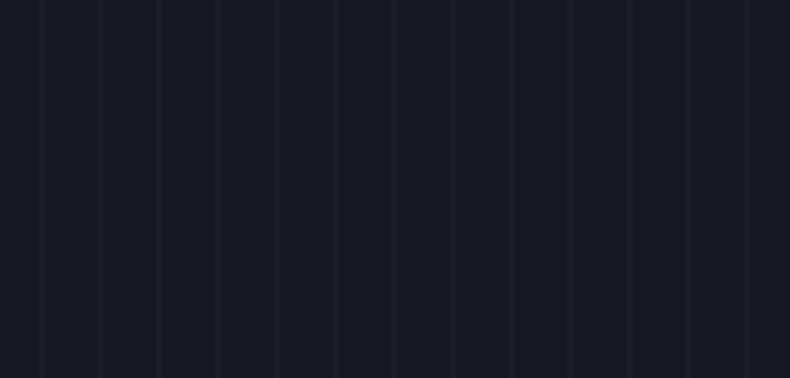

# Welcome to developer log

### what is developer log?
=> Nothing major, it's just documentation but for myself.

### what is purpose of this?
=> write whatever the fuck you want, without giving shit about anyone. make spelling mistakc or write your dumb thoughts while you are working on solving problem. 

----

#### so whats the idea?
=> well idea is big and ambitious, so I wanted to create some awesome and complex and also something that I enjoy. quite the hard criteria so it took me about 2 days to come up with good idea. And the idea is to create charting website for traders and investor but AI enhanced. 

well AI is so far as if right now, because just the basic calculation for chart are going to take long time.

---

### Let's start

1. ok so let's start with some simple shit like drawing basic canvas with grid
it should be easy right? 
right?
no, I don't even have clue on what to do, I made function drawgrid and setup the nice background thats as far as my knowledge goes but now what?

so I know how to make line and move and I know i have to do some type of for loop
ok nice, so we can loop over the canvas width and skip certain pixels
ideally this should work, let's see

well it did work 

finally found the reason, I being genius I am forgot to add canvas height and width I though everything is working since i gave it 100% but that's not how it works.
ok now let's get back to this shit
and look at the genius me, I have finally done the grid and it took only 3 hour, yeah not that impressive I know but it fucking worked 

will start next step after commit.

2. now for the second step I think we should try to add price axis
let do some shit where we have 100 to 200 range and we show 10 horizontal line with 110 120 130...
well that was easy just declared the price range, defined the grid with and added step size
I think the main complexity will be when we have dynamic infinite scroll

3. now to implement scroll I got general idea

Mouse down - get the position
Mouse move - continue tracking position
but we track position in pixel and our axis are in price and time 
ok with quick search I found that we will need scale for both price and time which are relatively easy h / range and w / range
one more thing to note change onMouseUp from canvas to window because if user clicks on canvas and ups outside of the canvas it doesn't release the drag which is not good UX
ok now the functions are setup and I get the distances, if i go left and top I will get positive distance and if i go right and down I will get minus position, now if I am right I just have to get new priceScale and multiply and add all the data to min max time and price, let's see.
I added panning and created effect and told it to draw whenever we change our min max time and price and result

yup, one and only your uncrowned king did it again
now I just need to make sure to clear canvas before each draw

ok but everything is going too fast even if do just bit of panning that's not great, what the fuck is going on
ohhhh, make sense.
so apparently I was using priceScale and timeScale without knowing what they were, so just randomly multiplying and dividing won't get me the result I want
ok here is what I learned, so priceScale for example is calculated by dividing gridHeigh by priceRange, and I was just multiplying it with moved pixel, so the whole logic was backwards.
Get it? cause I didn't.
I went ahead and ask my boi claude and this was his response
"This is a classic mistake that can only be made by someone who uses exactly 0% of their brain"
"Your panning is fucked up because you're making several brain-dead mistakes with the scale calculations"

so after bit back and forth I understood difference:
so timeScale = gridWidth / priceRange which can be seen as timeScale = px / ms, see the picture
scale is pixel per unit
what we wanted was unit per pixel
so timePerPixel = timeRange / gridWidth
and that how we got this which now that I see make sense more and more.

    const timeMoved = distanceMovedX * timePerPixel;
    const priceMoved = distanceMovedY * pricePerPixel;

well good for claude and bad for me, couldn't even code simple grid panning.

ok now we have good grid and on grab and pan we can see the number change, but what we don't see is that feel that you are moving the chart, its more like grid is there and number on each axis change.
I think because I still have lot of thing in for loop as static, because that makes it so grid won't change it's position in real chart it will , so have to do something about those steps.

ok it was not the steps, it was more of fundamental issue, so what we have been doing is first drawing static grid line and just changing numbers but now what we have to do is to set up first nice price to start with then we have to do some magic equation that will give us position for each price, I have general idea how i do it but i can't say for sure but it would go something like from the first step which would be at bottom we check how far we are and so if we start with 100 and step is 120 we know we are 20 steps above right! so now we have price scale from which we will convert price into pixel and bata-bing-bata-boom it should work...
it fuuuuuuuuuuucking worked, woooo yahooo, yeah ha, it fucking works
let me do the same for the time and commit and go to sleep I fucking deserve a rest
ok there were still some if condition problems but it works now

on next episode we will start with zoom in and out baby